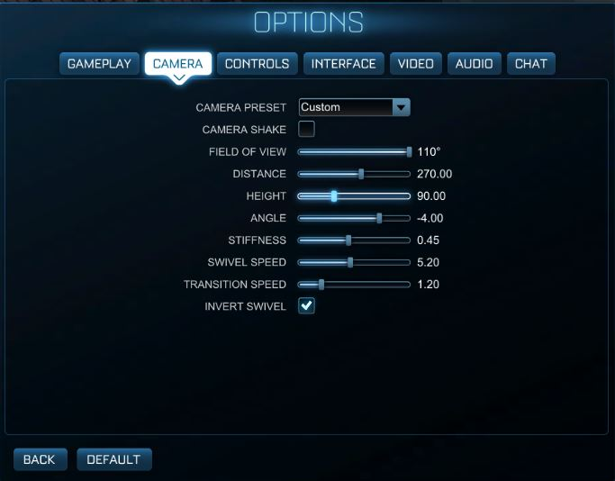

# RL-SelfDrivingCar
Self driving car for the game rocket league.

## In game settings for optimal use:
- Resolution: 1366x768 16:9
- All advanced settings turned off except for transparent goal posts
- Render/Texture/World/Particle quality and detail as high as possible
- Boost: Left Click
- Jump: Right Click
- Powerslide: Shift
- Movement: WASD

### Camera Settings:

### Video Stream Controls:
- q to quit
- p to pause

